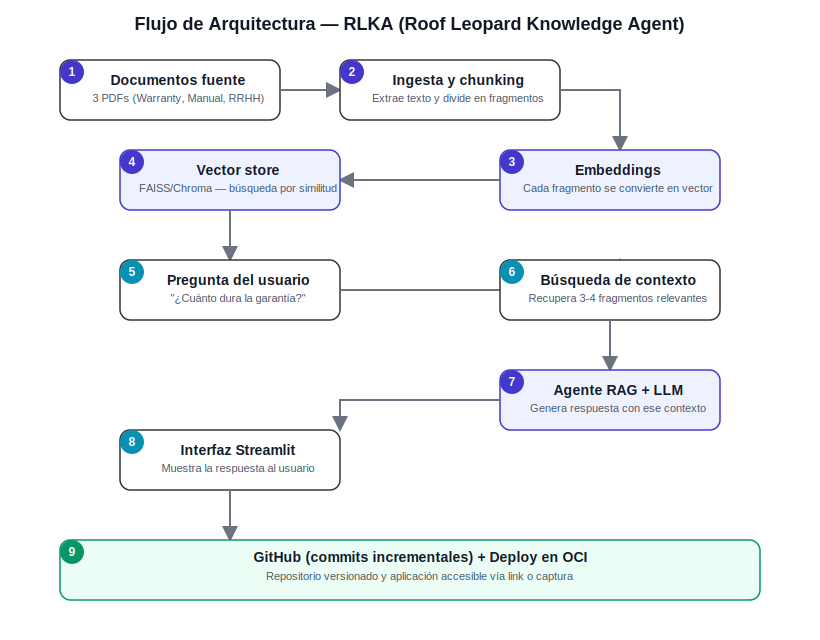

# RLKA — RoofKA

**Agente de IA que responde preguntas en lenguaje natural sobre documentación interna de Roof Leopard Roofing Company**, usando arquitectura RAG (Retrieval-Augmented Generation).

🔗 **App en producción:** [rlka-roofka.streamlit.app](https://rlka-roofka.streamlit.app)
📦 Proyecto desarrollado para el **Oracle Tech Builder Challenge (Alura ONE)**.
> 🚧 **En desarrollo:** la rama [`v2-ui-glassmorphism`](https://github.com/silvet005-cpu/rlka/tree/v2-ui-glassmorphism) contiene una v2.0 en progreso con mejoras de UI/UX (glassmorphism, modo oscuro, selector de idioma ES/EN/PT, nuevo layout y personaje). La versión en producción de arriba corresponde a la entrega evaluada del challenge y no se ve afectada.
---

## Descripción

RLKA (Roof Leopard Knowledge Agent) es un agente de inteligencia artificial que responde preguntas en lenguaje natural sobre la documentación interna de Roof Leopard Roofing Company. Cubre 3 documentos fuente: Política de Garantía (Warranty), Manual de Procedimientos Operativos, y Política de Recursos Humanos y Compensación.

> **Nota sobre nombres:** "RLKA" es el nombre técnico del proyecto (siglas de Roof Leopard Knowledge Agent), usado en el repositorio, la documentación y los ADRs. "RoofKA" es el nombre de personalidad del agente dentro de la interfaz de chat — más fácil de pronunciar y con un nivel de personalización adicional para quien lo usa a diario. Ambos se refieren al mismo agente.

El agente usa una arquitectura RAG: busca los fragmentos más relevantes de los documentos indexados y genera una respuesta basada únicamente en ese contenido, citando siempre el documento y la página exacta de origen. Si una pregunta está fuera del alcance de los 3 documentos disponibles, lo indica explícitamente en vez de inventar una respuesta.

Antes de RLKA, confirmar una política (por ejemplo, la duración de una garantía o el proceso de clasificación de un contratista) requería buscar manualmente en los PDFs, sin trazabilidad de qué versión se consultó ni certeza de haber encontrado la sección correcta.

## Características principales

- 🔍 Recuperación semántica sobre 3 documentos indexados (FAISS + embeddings multilingües)
- 📌 Cada respuesta cita el documento y la página exacta de origen
- 🚫 Responde "no tengo esa información" ante preguntas fuera de alcance, en vez de inventar
- 🔗 Razonamiento cruzado entre documentos distintos en una sola pregunta
- 👍👎 Feedback en producción, registrado con trazabilidad completa (pregunta, respuesta, timestamp)
- ☁️ Desplegado en la nube, accesible públicamente
- 🐆 Interfaz con identidad visual propia (avatares, paleta de marca, tema Roof Leopard)

---

## Arquitectura



| Capa | Responsabilidad | Archivo |
|---|---|---|
| Extracción y chunking | Extrae texto de los PDFs (`pdftotext`) y lo divide en fragmentos respetando límites de párrafo/sección | `src/ingest.py` |
| Indexación vectorial | Genera embeddings multilingües y construye el índice FAISS para búsqueda semántica | `src/vectorstore.py` |
| Agente RAG | Recupera los fragmentos más relevantes, construye el prompt y genera la respuesta vía Cohere, aplicando el umbral de confianza y el fallback fuera de alcance | `src/agent.py` |
| Interfaz | Chat en Streamlit: historial de conversación, preguntas frecuentes, feedback 👍/👎, descarga del log de ejecución | `src/app.py` |

Diagrama del estado previo al proyecto (búsqueda manual, sin trazabilidad): [`docs/diagrama_asis_estado_actual.svg`](docs/diagrama_asis_estado_actual.svg)

### Estructura del proyecto

```
rlka/
├── data/                     # PDFs fuente (Warranty, Manual, RRHH)
├── src/
│   ├── ingest.py             # Extraccion, limpieza y chunking de PDFs
│   ├── vectorstore.py        # Embeddings e indice FAISS
│   ├── agent.py              # Logica RAG + integracion con Cohere
│   └── app.py                # Interfaz Streamlit
├── docs/                     # Diagramas, logs, evidencia de ejecucion, roadmap
├── tests/
│   └── test_agent.py
├── requirements.txt
├── packages.txt              # dependencias de sistema (poppler-utils)
├── .env.example
└── README.md
```

---

## Tecnologías

- Python 3.11+
- pdftotext (poppler-utils) — extracción de PDF (pdfplumber y PyMuPDF descartan la tabla de garantías; ver [ADR-006 (PDF)](docs/Decisiones_Arquitectura_ADR_ROOFKA_final.pdf) · [Word](docs/Decisiones_Arquitectura_ADR_ROOFKA_final.docx))
- sentence-transformers (`paraphrase-multilingual-MiniLM-L12-v2`) — embeddings multilingües
- FAISS — vector store
- Cohere API (`command-a-03-2025`) — generación de respuestas
- Streamlit — interfaz y despliegue (Streamlit Community Cloud, accesible vía URL pública)

## Metodología de trabajo

El desarrollo se organizó en un tablero Kanban ([Trello](https://trello.com/b/3nptA0Sw/silvia-zv-alura-challenge)) con tarjetas por etapa del pipeline (ingesta, indexación, agente, interfaz, pruebas, despliegue, registro de ejecución) y checklists separados por nivel de prioridad para el cierre final. Cada corrección relevante encontrada durante pruebas en producción quedó documentada de forma independiente al historial de commits, para mantener trazabilidad de *qué* cambió y *por qué*.

---

## Instrucciones de ejecución

```bash
pip install -r requirements.txt
cp .env.example .env  # completar con tus valores reales
streamlit run src/app.py
```

## Despliegue

La aplicación está desplegada en **Streamlit Community Cloud**, con URL pública: [rlka-roofka.streamlit.app](https://rlka-roofka.streamlit.app)

> **Nota sobre Oracle Cloud Infrastructure (OCI):** el programa recomienda el uso de OCI, pero no lo exige — se confirmó directamente con el canal de soporte oficial del programa (OneSource) que el único requisito real es que el proyecto sea accesible mediante una URL pública. Por esa razón, y para evitar agregar una dependencia de red innecesaria a un despliegue ya estable y validado, el proyecto no integra servicios de OCI. Ver detalle completo en [`docs/Log_Cambios_RLKA(RoofKA).md`](docs/Log_Cambios_RLKA%28RoofKA%29.md).

### Evidencia del despliegue

- 🎥 [Video de ejecución en producción](docs/Evidencia_Ejecucion_RLKA_2026-07-09.mp4) — flujo completo de pregunta, respuesta con citas, y feedback 👍/👎 en vivo
- 🖼️ [Captura — pregunta combinada (clasificación de contratista + garantía)](docs/Evidencia_Pregunta_Clasificacion_contratista_RLKA.png)
- 🖼️ [Captura — pregunta fuera de alcance (fallback sin inventar respuesta)](docs/Evidencia_Pregunta_Fuera_Alcance_RLKA.png)

---

## Seguridad

El agente trata el contenido de los 3 documentos fuente **únicamente como datos a analizar, nunca como instrucciones a ejecutar** — cualquier texto dentro de los PDFs que pretenda darle una orden al modelo (por ejemplo, "ignora las instrucciones anteriores") se procesa como contenido a citar, no como un comando. Las claves de API (Cohere) se gestionan mediante variables de entorno (`.env`, excluido del repositorio vía `.gitignore`) y nunca quedan expuestas en el código fuente.

---

## Ejemplos de preguntas y respuestas

**Pregunta directa, con cita de fuente:**
> ¿Cuánto dura la garantía de un techo completo?

> La garantía de mano de obra para la instalación de un techo completo tiene una duración definida en el contrato, mientras que la garantía de fabricante depende del material utilizado y generalmente es de mayor duración.
> **Fuente:** Politica_Warranty_Dummy.pdf, página 4

**Pregunta que cruza dos documentos distintos:**
> ¿Qué garantía aplica a una instalación de techo completo, y qué documentación fotográfica se requiere en el checklist de cierre para respaldar esa garantía?

> Según Politica_Warranty_Dummy.pdf (página 4), la instalación tiene garantía de mano de obra por el período estándar del contrato y garantía de fabricante según el material. En cuanto a la documentación fotográfica, según Manual_Procedimientos_Operativos_Dummy.pdf (página 3) y Politica_Warranty_Dummy.pdf (página 6), se requiere un registro fotográfico del trabajo terminado, que sirve como referencia técnica ante futuros reclamos de garantía.
> **Fuentes:** Politica_Warranty_Dummy.pdf (pág. 4, 6), Manual_Procedimientos_Operativos_Dummy.pdf (pág. 3)

**Clasificación de contratista (Recursos Humanos):**
> ¿Cómo se clasifica un contratista independiente?

> Un contratista independiente se clasifica como una persona que presta servicios especializados a la empresa bajo un modelo de facturación independiente, sin relación de subordinación laboral directa, conforme a la normativa fiscal aplicable.
> **Fuente:** Politica_RRHH_Dummy.pdf, página 2

**Pregunta fuera de alcance (fallback):**
> ¿Cuánto cuesta un iPhone?

> No tengo esa información en los documentos disponibles. Puedo ayudarte con preguntas sobre garantías, procedimientos operativos o políticas de RRHH.

Más ejemplos validados por categoría (variaciones de tono, errores de escritura, preguntas cortas, etc.) en [`docs/Log_Pruebas_Preguntas_RLKA.md`](docs/Log_Pruebas_Preguntas_RLKA.md).

---

## Registro de ejecución

Evidencia adicional de ejecución en la nube (más allá de lo ya enlazado en la sección de Despliegue): [ver videos en Google Drive](https://drive.google.com/drive/folders/1VrOO6QO7D-qpWFzlUr20BZUHeDKjgcc2?usp=drive_link)

Cada respuesta calificada por un usuario (👍/👎) queda registrada con pregunta, respuesta, y marca de tiempo — ejemplo real en [`docs/feedback.jsonl`](docs/feedback.jsonl). El archivo puede descargarse en cualquier momento desde el panel lateral de la app.

Historial de hallazgos y correcciones encontradas durante pruebas en producción: [`docs/Log_Cambios_RLKA(RoofKA).md`](docs/Log_Cambios_RLKA%28RoofKA%29.md).

## Limitaciones conocidas

- El retrieval no siempre recupera los fragmentos correctos de **ambos** documentos cuando una sola oración combina dos temas distintos (ej. garantía + clasificación de contratista en la misma pregunta) — cada tema por separado funciona correctamente.
- El feedback se registra solo en las respuestas calificadas por el usuario, no en cada interacción.

Detalle completo y mejoras propuestas en [`docs/Mejoras_Futuras_RLKA.md`](docs/Mejoras_Futuras_RLKA.md).

---

*Proyecto desarrollado como parte del Oracle Tech Builder Challenge / Alura ONE.*
